# ISP Box Management Interface

> A web-based management interface for a simulated ISP (Internet Service Provider) network, built with 3 Linux VMs. Inspired by real ISP box dashboards, designed to be beginner-friendly while exposing real network services under the hood.


---

## Table of Contents

- [Overview](#overview)
- [Architecture](#architecture)
- [Network Configuration](#network-configuration)
- [Features](#features)
  - [NAT & Internet Access](#nat--internet-access)
  - [DHCP Management](#dhcp-management)
  - [DNS Management](#dns-management)
  - [Bandwidth Testing](#bandwidth-testing)
  - [Modem Info & Logs](#modem-info--logs)
- [Interface Screenshots](#interface-screenshots)
- [Tech Stack](#tech-stack)
- [File Structure](#file-structure)
- [Tests & Validation](#tests--validation)
- [Known Limitations & Future Work](#known-limitations--future-work)

---

## Overview

This project simulates an ISP infrastructure using 3 VirtualBox VMs (Box, Client, FAI) running Ubuntu. The **Box** VM hosts a PHP/Apache web interface that lets a user manage core network services — DHCP, DNS, bandwidth — without touching the command line directly.

All configurations are **persistent** (written to system files like `/etc/dhcp/dhcpd.conf`, `/etc/bind/`, `/etc/network/interfaces`) and **automated** via Shell scripts called by the PHP backend.

---

## Architecture

```
┌──────────────────────────────────────────────────────────────────────┐
│                        NETWORK TOPOLOGY                              │
│                                                                      │
│   ┌───────────┐    192.168.1.0/24       ┌──────────────────────┐     │
│   │  CLIENT   │◄──────────────────────► │        BOX           │     │
│   │  VM       │     eth1 (static)       │  eth1: 192.168.1.1   │     │
│   │192.168.1.4│                         │  eth2: 192.168.2.2   │     │
│   └───────────┘                         │  eth0: NAT (Internet)│     │
│                                         └──────────┬───────────┘     │
│                                                    │ 192.168.2.0/24  │
│                                         ┌──────────▼───────────┐     │
│                                         │         FAI          │     │ 
│                                         │  eth1: 192.168.2.1   │     │
│                                         │  eth0: NAT (Internet)│     │
│                                         │  DNS master (bind9)  │     │
│                                         └──────────────────────┘     │
└──────────────────────────────────────────────────────────────────────┘
```

**Two internal networks:**
- `192.168.1.0/24` — Box ↔ Client(s)
- `192.168.2.0/24` — Box ↔ FAI

The **Box** acts as a router/gateway between both networks. Clients access the internet via the Box's NAT (not their own eth0).

---

## Network Configuration

Each VM's network is configured statically in `/etc/network/interfaces` for persistence across reboots.

**Box** (`eth0` NAT, `eth1` internal LAN, `eth2` FAI link):

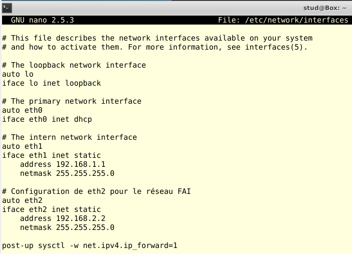

**Client** (`eth0` NAT disabled, `eth1` internal — routes internet via Box):

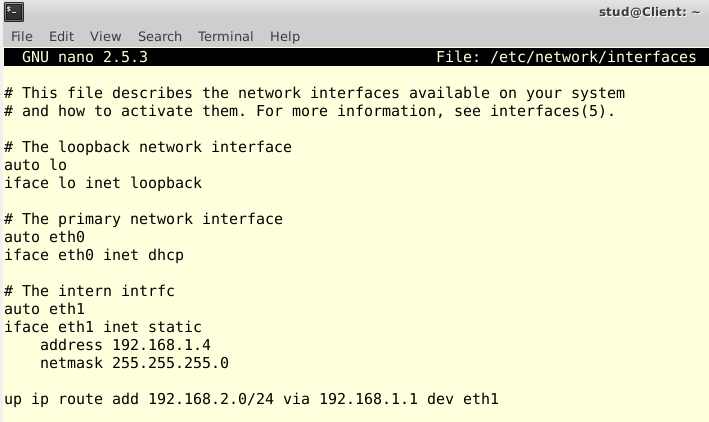

**FAI** (`eth0` NAT, `eth1` internal — DNS master, FTP server):

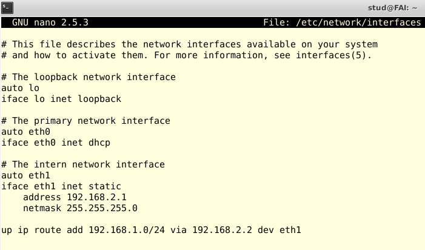

---

## Features

### NAT & Internet Access

The script `ConfigurationNAT.sh` configures IP masquerading on the Box so client VMs access the internet through it:

- Client traffic is forwarded from `eth1` → `eth0` on the Box
- The client's default route is updated to point to the Box as its gateway
- `arp-scan` is used to detect connected devices on the LAN

**Validation:** `ping 8.8.8.8` from client + `curl ifconfig.me` returns the Box's public IP (`37.171.123.223`).

**Key files:**
```
/home/stud/connected_devices.sh
/var/www/html/connected_devices.php
```

---

### DHCP Management

The Box runs `isc-dhcp-server` and distributes IP addresses to LAN clients. The interface exposes full DHCP lifecycle management.

| Feature | Description |
|---|---|
| **Standard range** | User sets pool size → auto-generated from `192.168.1.2` |
| **Advanced range** | User sets start/end IPs manually, with full validation |
| **Delete config** | Removes current DHCP config (with confirmation warning) |
| **View range** | Displays current pool in plain language |
| **Modify lease** | Changes IP lease duration in seconds |
| **Enable / Disable** | One-click start/stop of the DHCP service |

**Input validation highlights:**
- Pool size capped at 253 (avoids exceeding subnet + broadcast `192.168.1.255`)
- Advanced mode: valid IP format, end > start, same subnet, no router/broadcast conflict
- No concurrent DHCP configs allowed

**Key files:**
```
/home/stud/DHCP/DHCP_Clients.sh
/home/stud/DHCP/DHCP_ClientsAvancé.sh
/home/stud/DHCP/delete_Config_DHCP.sh
/home/stud/DHCP/affich_plage.sh
/home/stud/DHCP/modif_bail.sh
/var/www/html/DHCP.php
```

---

### DNS Management

The Box is configured as a **secondary DNS server** (slave) for the zone `amel.com`, whose primary is on the FAI. DNS records are managed via SSH from the Box to the FAI's bind9 database (`/etc/bind/db.amel.com`).

| Feature | Description |
|---|---|
| **Add subdomain (standard)** | Creates an `A` record pointing to the Box IP (`ns1.amel.com`) |
| **Add subdomain (advanced)** | Creates `A`, `MX`, or `CNAME` records |
| **Delete record** | Removes a record by name and type |
| **View records** | Displays all current zone entries in human-readable form |

**Record type details:**
- `A` — maps name to IP
- `MX` — routes email to `mail.amel.com` (hosted on Box)
- `CNAME` — alias, e.g. `blog.amel.com → amel.com`

**Blocked subdomain names** (to prevent conflicts and abuse):
- Reserved services: `www`, `mail`, `ftp`, `smtp`, `dns`, `ns`, `amel`
- Sensitive: `login`, `secure`, `root`, `admin`, `webmail`
- Internal: `dev`, `staging`, `test`, `local`, `prod`
- Standard reserved: `example`, `localhost`, `invalid`

**Key files:**
```
/home/stud/DNS/add_record.sh
/home/stud/DNS/delete_record.sh
/home/stud/DNS/list_records.sh
/var/www/html/DNS.php
```

---

### Bandwidth Testing

Bandwidth is measured between Box and FAI over FTP (`vsftpd`). A 50 MB test file is pre-generated on the FAI:

```bash
dd if=/dev/urandom of=/home/stud/testfile bs=1M count=50
```

**`/etc/vsftpd.conf` key settings:**
```ini
listen=YES
anonymous_enable=NO
local_enable=YES
write_enable=YES
# chroot_local_user=YES    ← commented to allow write in chroot env
# listen_ipv6=YES          ← disabled to avoid restart errors
```

| Measurement | Method |
|---|---|
| **Download speed** | FTP `get testfile` — reports Mo/s + elapsed time |
| **Upload speed** | FTP `put testfile` — reports Mo/s + elapsed time |
| **Latency (ping)** | `ping -c 5 <target>` — reports min/max/avg/mdev |

**Key files:**
```
/home/stud/DEBIT/download_speed.sh
/home/stud/DEBIT/upload_speed.sh
/home/stud/DEBIT/ping_latency.sh
/var/www/html/DEBIT.php
```

---

### Modem Info & Logs

A dedicated page aggregates system and network information from the Box:

| Info | Command used |
|---|---|
| Private & public IPs | `hostname -I` |
| Uptime | `uptime -p` |
| Firmware version | kernel/OS version |
| Network stats (TCP/IP) | `netstat -i` |
| Action history | MySQL query on `historique` table |

**Key files:**
```
/home/stud/MODEM/ip_info.sh
/home/stud/MODEM/modem_info.sh
/home/stud/MODEM/network_stats.sh
/var/www/html/modem_info.php
```

#### Action Logging (MySQL)

Every user action (DHCP, DNS, bandwidth) is logged to the `historique` table in the `projet_reseaux` MySQL database via `saveBdd.php`.

Each log entry captures:
- `action_type` — e.g. `add_record`, `delete_config`, `start`
- `action_details` — success/error message
- `user` — username who triggered the action
- `action_time` — timestamp

The PHP files call `saveBdd.php` via `curl` to write log entries:

```php
function log_action($NOMACT, $DETAILS, $USER, $TIME) {
    $command = "curl -X POST -d \"type=$NOMACT&details=$DETAILS&user=$USER&time=$TIME\" http://192.168.1.1/saveBdd.php";
    $output = shell_exec($command);
    return $output;
}
```

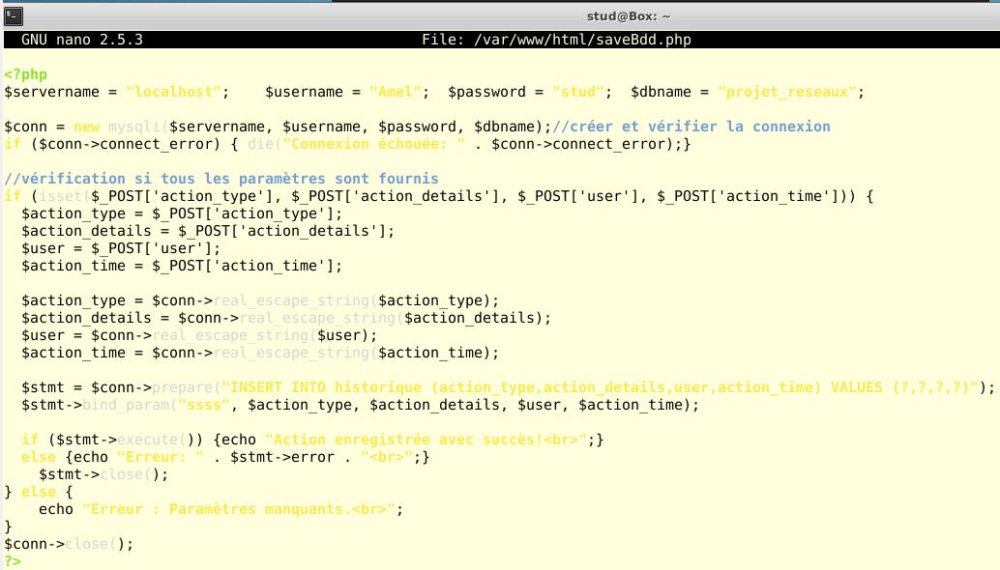

---

## Interface Screenshots

### Home Page

4 widgets: Connected devices, Speed test, Advanced settings, Modem info.

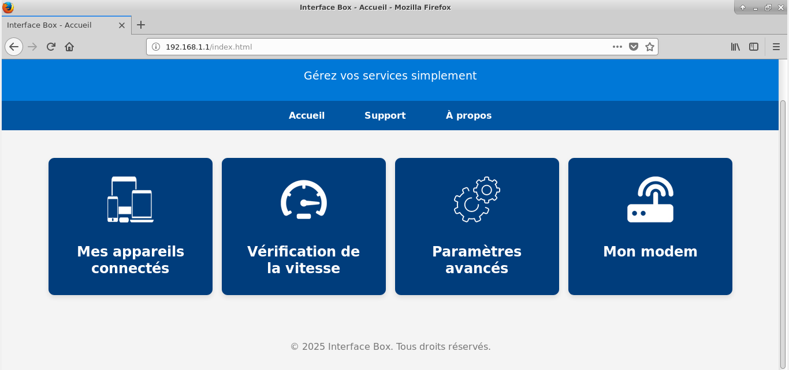

---

### Advanced Parameters

Navigation hub to DHCP, DNS, and other settings.

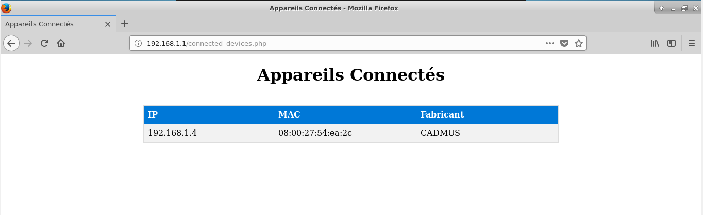

---

### DHCP Configuration

<table>
<tr>
<td>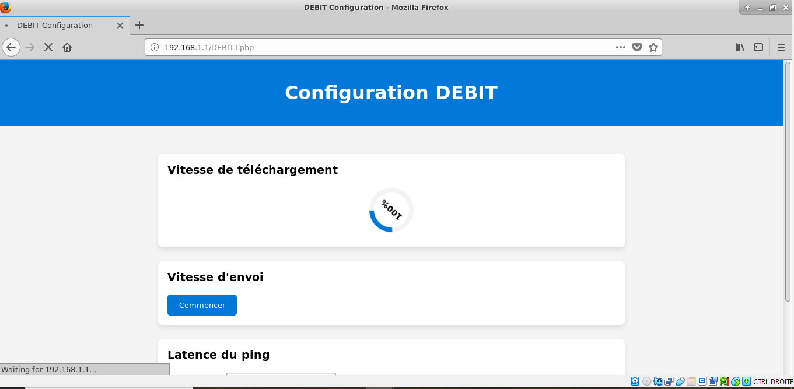</td>
<td>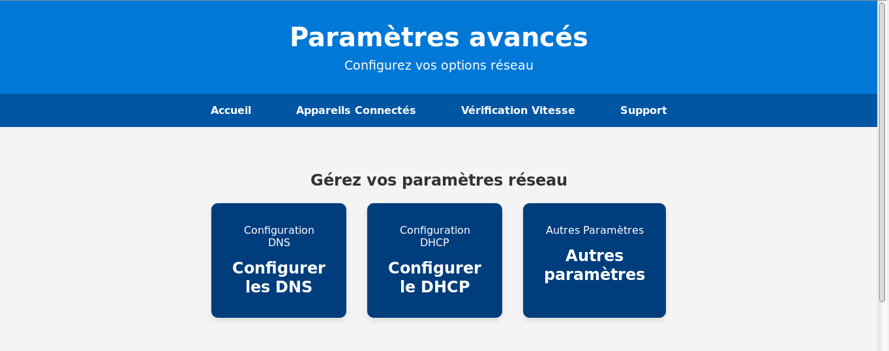</td>
</tr>
<tr>
<td>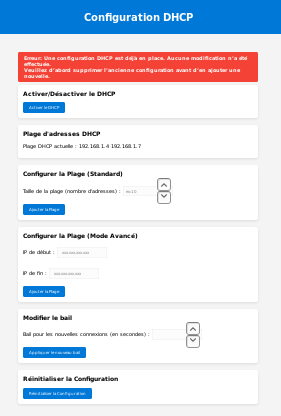</td>
<td>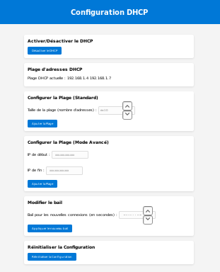</td>
</tr>
</table>

Notifications appear at the top of the page — **green** for success, **red** for errors — and auto-dismiss after 4.5 seconds.

---

### DNS Configuration

<table>
<tr>
<td>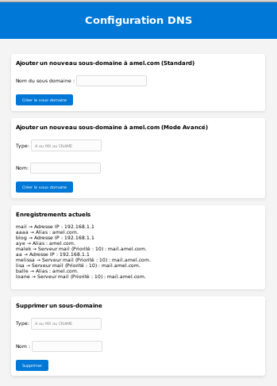</td>
<td>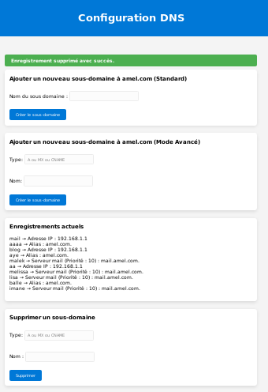</td>
</tr>
<tr>
<td>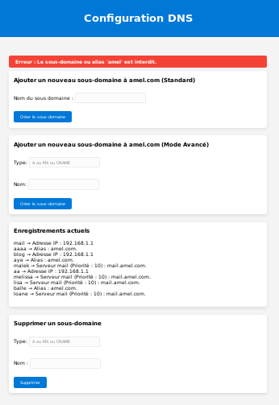</td>
<td>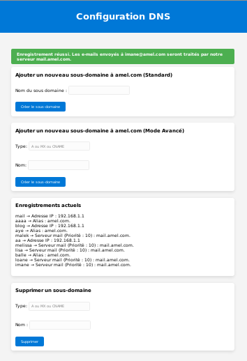</td>
</tr>
</table>

---

## Tech Stack

| Layer | Technology |
|---|---|
| Web server | Apache2 |
| Backend | PHP |
| Frontend | HTML, CSS, JavaScript |
| Automation | Bash shell scripts |
| DHCP server | isc-dhcp-server |
| DNS server | bind9 |
| Database | MySQL (`projet_reseaux`) |
| FTP | vsftpd |
| Remote exec | OpenSSH (key-based, no password) |
| Network scan | arp-scan |

---

## File Structure

```
/
├── home/stud/
│   ├── DHCP/
│   │   ├── DHCP_Clients.sh           # Standard IP range
│   │   ├── DHCP_ClientsAvancé.sh     # Advanced IP range
│   │   ├── delete_Config_DHCP.sh     # Delete DHCP config
│   │   ├── affich_plage.sh           # Display current range
│   │   └── modif_bail.sh             # Modify lease time
│   ├── DNS/
│   │   ├── add_record.sh             # Add DNS record (A/MX/CNAME)
│   │   ├── delete_record.sh          # Delete DNS record
│   │   └── list_records.sh           # List zone records
│   ├── DEBIT/
│   │   ├── download_speed.sh         # FTP download benchmark
│   │   ├── upload_speed.sh           # FTP upload benchmark
│   │   └── ping_latency.sh           # Latency measurement
│   ├── MODEM/
│   │   ├── ip_info.sh                # IP address info
│   │   ├── modem_info.sh             # System info (uptime, firmware)
│   │   └── network_stats.sh          # netstat stats
│   ├── ConfigurationNAT.sh           # NAT setup for client internet access
│   └── connected_devices.sh          # arp-scan LAN devices
│
└── var/www/html/
    ├── index.html                    # Home page (4 widgets)
    ├── connected_devices.php         # Connected devices page
    ├── DEBIT.php                     # Bandwidth test page
    ├── DHCP.php                      # DHCP management page
    ├── DNS.php                       # DNS management page
    ├── modem_info.php                # Modem info & logs page
    └── saveBdd.php                   # Central action logger (MySQL)
```

---

## Tests & Validation

### DHCP

```bash
# On Client VM — request IP from DHCP server
sudo dhclient eth1

# Verify assigned address
ip addr show eth1

# Test connectivity between VMs
ping 192.168.1.1   # Box
ping 192.168.2.1   # FAI
```

### DNS

```bash
# Test A record
nslookup subdomain.amel.com

# Test CNAME
nslookup alias.amel.com

# Test MX record
nslookup -query=MX name.amel.com
```

**Test results:**

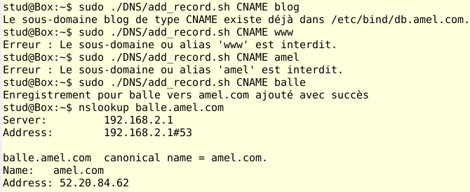

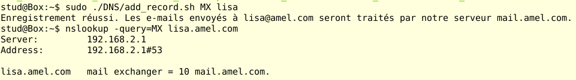

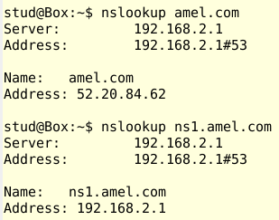

### Bandwidth

Tested via the web interface directly:


> Download speed measured at **3.12 Mo/s** over FTP between Box and FAI VMs.

---

## Known Limitations & Future Work

| Area | Current state | Potential improvement |
|---|---|---|
| Bandwidth history | Not stored — only live measurement | Log measurements to DB with timestamps for trend analysis |
| Interface | Pure HTML/CSS, no framework | React/Vue for richer UI components |
| Modem info display | Basic table layout | Charts/graphs for network stats, filterable action log |
| Action history | Flat log, no filtering | Categories, date filters, export |
| DHCP conflict handling | Blocks simultaneous configs entirely | Could allow modification of existing config directly |

---

## What I Learned

Working on this project gave me hands-on experience with:

- **Shell scripting** — using `sed`, `grep`, pipes to manipulate config files and extract data
- **Real network protocols** — configuring and debugging DHCP, DNS (A/MX/CNAME), NAT, routing tables
- **SSH key-based auth** — passwordless remote execution from Box to FAI for DNS record management
- **Linux permissions** — managing `www-data` vs `root`/`sudo` access securely for web-triggered system commands
- **PHP ↔ Shell integration** — calling shell scripts from PHP and feeding results back to the UI
- **MySQL from PHP** — prepared statements, connection handling, centralized logging pattern

---

*Project developed as part of the AMS Networks course (S5) — Avignon University / CERI, 2024–2025.*
